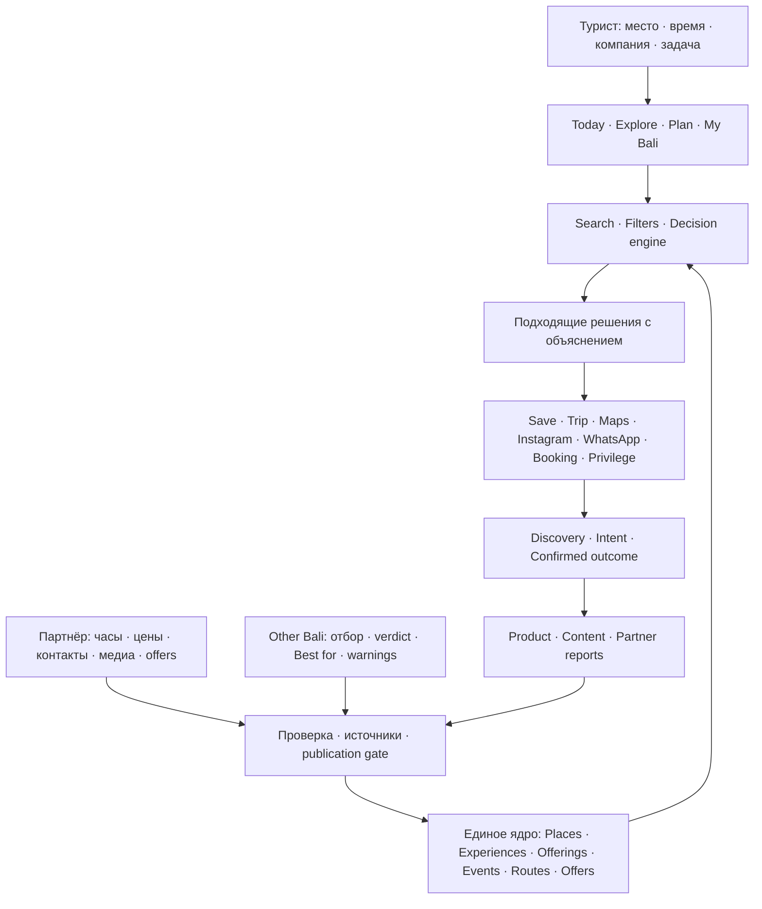
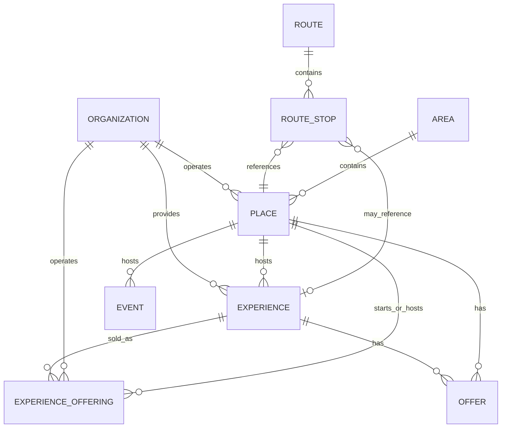
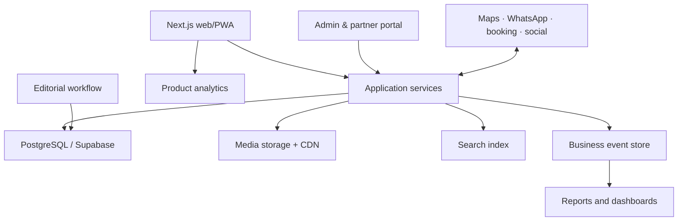

# Other Bali — целевая продуктовая, информационная и техническая архитектура

**Версия:** 3.1 CORRECTED
**Дата:** 22 июля 2026
**Статус:** единый исправленный master; заменяет V3.0, V2.0, V1.x и Bali Privilege/Canggu drafts
**Владелец решения:** Selena
**Публичный язык продукта:** English
**Рабочий язык команды и документации:** Russian

**Статусы утверждений:** архитектурные нормы в этом документе — `[DECISION]`; наблюдения о production должны быть подтверждены как `[LIVE]`; неизвестное помечается `[VERIFY]`; будущая отключённая возможность — `[RESERVED]`. Документ не превращает предположение о live-системе в факт.

---

## 0. Решение в одном абзаце

Other Bali — единый цифровой продукт для выбора и планирования поездки по всему Бали. Он помогает туристу решить четыре непересекающиеся задачи: **принять решение на месте через Today**, **исследовать варианты через Explore**, **спланировать будущую поездку через Plan**, **сохранить и использовать личные выборы через My Bali**. Территория — данные, фильтр и контекст, а не отдельная версия продукта. Privileges — необязательный коммерческий слой внутри релевантной карточки; он не является режимом навигации, не влияет на органическое ранжирование и не нужен для базовой полезности продукта.

---

# 1. Что мы строим

## 1.1. Продуктовая формула

> **Other Bali helps travellers choose the right place, activity or route for the moment they are in — and take the next action.**

Продукт отвечает не на вопрос «что существует на Бали?», а на вопросы:

- что подходит именно мне;
- куда пойти сейчас;
- что выбрать из похожих вариантов;
- как собрать день или поездку;
- что нужно знать до визита;
- какое действие сделать дальше.

## 1.2. Четыре публичных режима

| Режим | Ситуация туриста | Главный результат |
|---|---|---|
| **Today** | Уже на Бали, решение нужно сейчас | Короткий объяснимый shortlist и быстрое действие |
| **Explore** | Хочет самостоятельно исследовать | Сравнение мест, experiences, events, areas и collections |
| **Plan** | Планирует будущий день или поездку | Готовый или персональный план по дням |
| **My Bali** | Уже сохранял места и маршруты | Saved, personal trips, навигация и повторный доступ |

## 1.3. Что является модулем, а не отдельным продуктом

- **Privileges** — дополнительное предложение партнёра внутри места или активности; отдельная публичная витрина в V3.1 не запускается.
- **Booking links** — выход к официальной брони или партнёру.
- **Maps** — навигационная подложка, не конкурентная карта Other Bali.
- **Partner portal** — источник фактических обновлений и отчётности.
- **Editorial CMS** — редакционная система принятия решений.

## 1.4. Что мы сознательно не строим

- ещё один Google Maps;
- справочник всех компаний Бали;
- систему пользовательских отзывов на старте;
- полноценный marketplace booking engine; допускается только узкий seated-booking rail, необходимый текущей money model;
- скидочную карту как главный продукт;
- отдельные продукты для web и PWA;
- отдельную архитектуру для каждого района.

---

# 2. Финальная архитектура одним листом



Главный принцип: **турист получает объяснимое решение; партнёр поставляет факты; редакция контролирует рекомендацию; система измеряет поведение и возвращает результаты в контур качества.**

Эта схема является первой страницей master-ТЗ и выигрывает при конфликте с более старыми архитектурными материалами.

---

# 3. Информационная архитектура сайта

## 3.1. Основная навигация

| Раздел | Задача | Основные страницы |
|---|---|---|
| **Home** | Выбрать travel-context | Две основные двери: In Bali now / Planning a trip; partner-вход вторичный |
| **Today** | Решить, что делать на месте | Launch shortcuts, contextual shortlist, карта/список |
| **Explore** | Самостоятельно исследовать | Places, Experiences, Events, Areas, Collections |
| **Plan** | Подготовить будущий день/поездку | Day trips, 3/5/7 days, editable itineraries |
| **Areas** | Понять территорию | Province → regency/city → destination → locality |
| **My Bali** | Управлять личным планом | Saved, trip days, routes, recently viewed |
| **Search** | Найти по названию или задаче | Full-text + intent + filters |

**Privileges не входит в primary navigation V3.1.** Активный Offer показывается контекстно внутри подходящей карточки. Отдельный `/privileges` может появиться только по новому решению владельца и при достаточном полезном наполнении; это не текущий scope.

## 3.2. Публичные типы страниц

1. Главная.
2. Результаты поиска.
3. Категория.
4. Landing для утверждённого intent/scenario или launch shortcut.
5. Территория.
6. Карточка физического места.
7. Карточка активности или экскурсии.
8. Карточка события.
9. Карточка маршрута.
10. Редакционная подборка.
11. Мои сохранения.
12. Моя поездка.
13. Partner claim / update flow.

## 3.3. URL-модель

```text
/
/explore
/places/[slug]
/experiences/[slug]
/events/[slug]
/route/[slug]
/areas/[slug]
/collections/[slug]
/scenarios/[slug]
/search
/today
/plan
/my-bali
/my-bali/trips/[trip-id]
/partner/[organization-id]
```

Категория и район не должны кодироваться в URL карточки объекта. Если ресторан меняет категорию или административная таксономия уточняется, постоянный URL не ломается. Существующие live-URLs не переименовываются автоматически: `/route/[slug]` сохраняется как canonical live-route; любой redirect требует preservation review.

---

# 4. Пользовательские пути

## 4.1. Today

```text
Где вы / near me
→ что хотите сделать
→ когда
→ 1–3 уточнения
→ 3–8 вариантов
→ сравнение
→ карточка
→ Maps / WhatsApp / Booking / Save / Privilege
```

Минимальные вводы:

- текущее место или выбранная территория;
- задача: eat, swim, relax, explore, work, shop, nightlife;
- время: now, morning, afternoon, sunset, evening;
- при необходимости: с кем, бюджет, транспорт, дождь.

### Launch shortcuts, а не финальная taxonomy

Кнопки Today — продуктовые входы, которые помогают быстро начать выбор. До утверждения Taxonomy V1 они называются **launch shortcuts**, а не canonical `Scenario`.

- В один shortcut нельзя молча смешивать category, audience, constraint, location modifier и scenario как одинаковые значения.
- `Warung` остаётся category/type; `Solo` — audience/context; `Without scooter` — transport constraint; `Near me` — location modifier.
- Ровно шесть launch shortcuts выбираются только после Taxonomy V1 и редакционной проверки спроса.
- Новые shortcut labels меняются конфигурацией и контентом, а не миграцией схемы.

## 4.2. Plan

```text
Даты и база проживания
→ состав группы
→ интересы и темп
→ обязательные места
→ ограничения
→ предложенный план по дням
→ замена остановок
→ сохранение
```

## 4.3. Explore

```text
Google / social / direct
→ landing/category/area
→ список
→ фильтр
→ карточка
→ следующая карточка или действие
```

## 4.4. My Bali

```text
Возврат на сайт/PWA
→ My Bali
→ сегодняшний день
→ открыть следующую остановку
→ Maps
→ отметить посещённым / изменить план
```

---

# 5. Что вводит турист

Не анкета при входе, а progressive profiling: вопрос появляется только тогда, когда влияет на ответ.

| Группа | Поля | Обязательность |
|---|---|---|
| Контекст | current location, hotel/base area, dates | По ситуации |
| Намерение | task/intent, category, scenario | Обязательно одно |
| Время | now/date/daypart, available duration | По ситуации |
| Компания | solo, couple, family, friends, group | Опционально |
| Ограничения | children ages, mobility, dietary, weather | Только если релевантно |
| Бюджет | budget band или дневной бюджет | Опционально |
| Транспорт | walking, scooter, car, driver, boat | По маршруту |
| Предпочтения | quiet, social, romantic, local, premium | Опционально |
| Действия | saves, trip changes, dismissed items | Автоматически |

Система не просит пользователя повторять то, что уже видно из контекста или предыдущего поведения.

---

# 6. Доменная модель: какие сущности существуют

## 6.1. Основные сущности

| Сущность | Что это | Пример |
|---|---|---|
| **Organization** | Компания, бренд, оператор или государственный управляющий | Potato Head, tour operator |
| **Place** | Физическая точка, куда можно приехать | ресторан, пляж, храм, SPA |
| **Experience** | Деятельность или продукт, который можно совершить/купить | cooking class, day pass, dive trip |
| **Experience Offering** | Конкретный продаваемый вариант Experience у определённого оператора | shared dive trip at 08:00, private tour with pickup |
| **Event** | Активность с конкретной датой/расписанием | Sunday brunch, festival, workshop |
| **Offer** | Дополнительная выгода или промоусловие поверх обычного продукта | privilege, inclusion, limited package |
| **Route** | Упорядоченный план перемещения | Uluwatu Sunset Day |
| **Collection** | Редакционная подборка без обязательного порядка | Rainy-day places in Ubud |
| **Area** | Территориальная иерархия | Bali → Gianyar → Ubud |
| **Media asset** | Фото, видео, меню или документ с правами | hero image, menu PDF |
| **Source** | Основание для конкретного факта | official website, venue confirmation |
| **Verification** | Кто, когда и что подтвердил | hours verified 2026-07-15 |
| **Trip** | Личный пользовательский план | Selena’s Bali trip |
| **Interaction event** | Действие пользователя | maps_click, save_item |
| **Partner account** | Доступ организации к своим объектам | manager of a venue group |

## 6.2. Почему нельзя смешивать сущности

- Hotel — Place; afternoon tea — Experience; предложение «IDR 350k» — Offer; Sunday brunch 26 July — Event.
- Nusa Penida — Area; Kelingking Beach — Place; Nusa Penida West Tour — Experience; готовый день — Route.
- Restaurant brand — Organization; конкретный outlet — Place.

Если всё это хранить как «place», невозможно корректно управлять расписанием, ценой, операторами, несколькими филиалами, SEO и аналитикой.

## 6.3. Связи



---

# 7. Структура данных физического места

## 7.1. Идентичность

- internal id;
- canonical slug;
- official name;
- alternate names;
- organization id;
- primary type;
- secondary categories;
- publication status;
- operational status;
- claim status;
- created/updated/published timestamps.

## 7.2. География

- area hierarchy;
- formatted address;
- latitude/longitude;
- Google place id;
- map URL;
- entrance/pickup point;
- service radius, если применимо;
- near-airport / island / boat-access flags;
- transport notes;
- parking details.

## 7.3. Редакционный decision layer

Это данные Other Bali, партнёр не редактирует их напрямую:

- one-line verdict;
- why choose it;
- best for;
- not ideal for;
- audience fit;
- mood;
- best time/daypart;
- typical duration;
- price band;
- estimated spend range;
- booking difficulty;
- weather fit;
- transport fit;
- crowd pattern;
- noise level;
- editorial warnings;
- comparison notes;
- confidence score.

## 7.4. Практические факты

- weekly opening hours;
- seasonal/holiday exceptions;
- phone;
- WhatsApp;
- Instagram;
- official website;
- official booking URL;
- menu URL;
- delivery/takeaway URLs;
- accepted payment methods;
- reservation policy;
- dress code;
- minimum spend;
- age policy;
- cancellation policy;
- accessibility;
- languages;
- facilities and amenities.

## 7.5. Требования по типам мест

Общая таблица не должна содержать сотню пустых колонок. Специфические данные живут в профильных таблицах.

| Профиль | Дополнительные поля |
|---|---|
| Food & drink | cuisines, meal periods, alcohol, dietary options, average spend |
| SPA & wellness | treatments, duration, therapist policy, facilities, advance booking |
| Beach club/day use | pool access, minimum spend, bed policy, towel, children, sunset |
| Beach/nature | swim safety, tide, lifeguard, access difficulty, entrance fee |
| Temple/culture | etiquette, sarong, opening rules, ceremony impact, guide rules |
| Shopping | product types, local brands, shipping, custom orders |
| Family | age suitability, changing facilities, stroller access, supervision |
| Accommodation-linked | guest/non-guest access, day-use conditions, facility scope |

---

# 8. Данные активности, события, предложения и маршрута

## 8.1. Experience

- official title;
- canonical concept and possible host place;
- experience type;
- summary and editorial verdict;
- duration;
- requirements;
- age/fitness/swimming constraints;
- weather/tide dependency;
- safety notes;
- verification dates.

Experience описывает саму активность как единый редакционный объект. Цена, оператор, доступность и booking link не хранятся здесь, если у активности может быть больше одного продаваемого варианта.

## 8.2. Experience Offering / Booking Option

Каждая конкретная комбинация оператора, формата, расписания и условий бронирования хранится отдельно:

- experience id;
- operator organization id;
- host/start place;
- private/shared format;
- fixed departure or availability rule;
- start time and duration override;
- meeting point and pickup zones;
- capacity and minimum group size;
- languages;
- inclusions and exclusions;
- price, currency, unit and tax status;
- child/group/resident price variants;
- deposit and payment terms;
- cancellation and rescheduling rules;
- official booking URL or booking channel;
- availability source and last checked time;
- operational status and verification.

Один Experience может иметь несколько Offerings. Пользователь сравнивает варианты, но редакционная страница активности остаётся единой и не дублируется под каждого оператора.

## 8.3. Event

- title;
- host/organizer;
- start/end datetime with Bali timezone;
- recurrence rule;
- doors/arrival time;
- venue;
- ticket/free status;
- capacity;
- booking URL;
- age restrictions;
- cancellation/postponement state;
- last verified time.

## 8.4. Offer / Privilege

- offer type: privilege, discount, inclusion;
- headline shown to tourist;
- exact benefit;
- eligibility;
- required purchase;
- valid dates and weekdays;
- valid time window;
- blackout dates;
- inventory/usage limit;
- per-person/account limit;
- redemption method;
- partner terms version;
- active/paused/expired status;
- verification owner and date.

Offer не заменяет Package, TicketOption, PriceOption или BookingOption. Он хранит только дополнительную выгоду и условия её применения. Цена Offer публикуется только из официального подтверждённого источника; иначе поле остаётся пустым.

### Sponsored — reserved, disabled, out of scope

В V3.1 нет продаваемого sponsored placement или visibility tier. `SponsorshipCampaign`, sponsored result blocks, paid-rank controls и их публичные страницы:

- **RESERVED** в namespace/Decision Log для возможного будущего решения;
- **DISABLED** в runtime, admin и partner portal;
- **OUT OF SCOPE** для текущей схемы, миграций, API, UI и продаж.

Их нельзя реализовывать «на будущее» или выводить из старых Bali Privilege документов. Включение требует явного изменения money-model канона, отдельной спецификации disclosure и нового решения Селены.

## 8.5. Route

- title and promise;
- target audience;
- start area and optional end area;
- duration and recommended start;
- pace;
- transport mode;
- season/weather fit;
- total estimated cost;
- ordered stops;
- arrival and dwell time per stop;
- travel time between stops;
- reason for each stop;
- bookings required;
- contingency and rain alternative;
- safety/etiquette notes;
- route freshness date;
- editorial owner.

---

# 9. Таксономия и фильтры

Таксономия — централизованный справочник, а не произвольные теги редакторов.

## 9.1. Территории

```text
Bali province
→ 8 regencies + Denpasar city
→ destination / island cluster
→ locality / village / neighbourhood
```

Все девять административных единиц поддерживаются с первого дня модели данных. Наполнение может идти неравномерно, но код и схема не должны знать понятия «главный район».

## 9.2. Контролируемые словари

- object types;
- categories and subcategories;
- intents;
- scenarios;
- audiences;
- moods;
- dayparts;
- duration bands;
- budget bands;
- transport modes;
- weather fit;
- amenities;
- accessibility;
- dietary attributes;
- safety and etiquette warnings;
- commercial and editorial labels.

## 9.3. Правила

- один canonical key на понятие;
- публичный label отделён от внутреннего key;
- синонимы поиска не создают новые категории;
- изменения версионируются;
- удаление термина не ломает старые данные;
- для каждого фильтра описано, кто и на основании чего его ставит.

---

# 10. Recommendation / Decision Engine

## 10.1. Порядок отбора

1. **Hard constraints:** operational status, подтверждённый schedule, location, age, weather и availability — только если эти факты реально известны.
2. **Intent fit:** насколько объект решает выбранную задачу.
3. **Editorial quality:** completeness, confidence, freshness, decision readiness.
4. **Context fit:** расстояние, доступное время, транспорт, компания, бюджет.
5. **Diversity:** не выдавать восемь одинаковых мест.
6. **Personal signal:** сохранения, отказы, прошлые действия — только при достаточном согласии и данных.

Пример базового score:

```text
35% intent/scenario fit
20% editorial quality
15% freshness and verification
15% location/time feasibility
10% audience/preferences fit
5% behavioural usefulness
```

Вес — конфигурация и гипотеза, не вечная истина.

## 10.2. Коммерческое влияние

- партнёрский статус не повышает органический editorial score;
- privilege может быть фильтром или дополнительным сигналом, но не превращает плохое совпадение в рекомендацию;
- paid visibility и sponsored placement отсутствуют в V3.1;
- fee за подтверждённую seated-booking не влияет на порядок органической выдачи.

## 10.3. Объяснимость

Пользователь должен видеть причину:

> Recommended because it is rain-safe, 12 minutes away, suitable with children and available this afternoon.

---

# 11. Поиск

Поиск должен понимать:

- официальные и альтернативные названия;
- опечатки;
- территории;
- категории;
- естественные запросы: `quiet breakfast near Ubud`, `waterfall easy with kids`;
- популярные синонимы на английском;
- отсутствие результата и следующий лучший вариант.

Обязательные данные поиска:

- raw query;
- normalized query;
- detected intent/area/category;
- result count;
- shown item ids and ranks;
- clicked item;
- reformulation;
- zero-result flag;
- exit action.

Zero-result запросы — прямой список того, чего не хватает продукту или словарю.

---

# 12. Аналитика поведения

## 12.1. Три уровня доказательства

| Уровень | Примеры | Что можно честно утверждать |
|---|---|---|
| **Discovery** | search, filter, view, compare | Что человек искал и смотрел |
| **Intent** | save, Maps, WhatsApp, Instagram, booking | Какое следующее действие выбрал |
| **Outcome** | confirmed booking, privilege redemption, verified visit | Подтверждённый результат |

Maps click нельзя называть посещением. Instagram click нельзя называть подпиской или бронью.

## 12.2. Обязательные события

### Acquisition

- session_started;
- landing_viewed;
- campaign_or_qr_opened;
- consent_updated.

### Discovery

- search_submitted;
- search_zero_results;
- filter_applied;
- result_impression;
- item_compared;
- place_viewed;
- experience_viewed;
- route_viewed;
- collection_viewed.

### Intent/action

- menu_opened;
- instagram_clicked;
- maps_clicked;
- whatsapp_clicked;
- website_clicked;
- booking_clicked;
- phone_clicked;
- item_saved;
- item_unsaved;
- trip_created;
- item_added_to_trip;
- item_removed_from_trip;
- trip_stop_reordered;
- route_opened_in_maps;
- share_clicked.

### Privilege/outcome

- offer_viewed;
- offer_claimed;
- redemption_started;
- redemption_confirmed;
- redemption_rejected;
- booking_confirmed, только при реальном callback/подтверждении.

## 12.3. Общий event envelope

Каждое событие содержит:

- event_id;
- occurred_at;
- anonymous_id;
- authenticated_user_id, если есть;
- session_id;
- event_name and schema_version;
- page and referrer;
- acquisition source/campaign/QR partner;
- object_type and object_id;
- position/rank/list context;
- area and user mode;
- device, locale and app surface;
- experiment variant;
- consent state;
- properties JSON по строгой схеме.

## 12.4. Ключевые воронки

1. Landing → search → result → card → external action.
2. Area/category → card → save → return → Maps.
3. Route view → save → edit → navigation.
4. Partner QR → place/collection → action → confirmed outcome.
5. Offer view → claim → redemption.

## 12.5. Основные отчёты

- что люди ищут;
- какие запросы остаются без ответа;
- какие места сравнивают;
- какие карточки приводят к действиям;
- по каким каналам приходят;
- как planning превращается в on-island action;
- где пользователь выходит;
- какие маршруты сохраняют и используют;
- фактический вклад по партнёрам;
- качество и свежесть контента.

---

# 13. Контент, источники и доверие

## 13.1. Разделение ответственности

| Слой | Кто владеет |
|---|---|
| Официальные факты | Партнёр + редакционная проверка |
| Editorial verdict | Только Other Bali |
| Best for / Not ideal for | Только Other Bali |
| Цены и условия | Источник + дата проверки |
| Фото/видео | Правообладатель + лицензия |
| Автоматическая аналитика | Система |

## 13.2. Каждое изменяемое утверждение должно иметь

- source type;
- source URL/reference;
- extracted value;
- verified_at;
- verified_by;
- confidence;
- next_review_at;
- status: verified, needs verification, disputed, stale.

## 13.3. Publication gate

Карточка публикуется только если есть:

- корректная идентичность и география;
- рабочее основное действие;
- минимум decision-ready редакционных данных;
- одна разрешённая качественная фотография;
- дата проверки;
- отсутствие критического конфликта источников.

Index,follow получает только карточка, которая дополнительно имеет уникальную ценность, достаточную полноту и внутренние ссылки. Публикация и SEO-индексация — разные решения.

## 13.4. Lifecycle

```text
candidate → research → draft → partner/fact check → editorial review
→ published → monitored → stale → reverified / unpublished / closed
```

Закрытые места не удаляются молча: сохраняется статус, редирект и релевантная альтернатива, если это уместно.

---

# 14. Кабинет партнёра

## 14.1. Партнёр может

- claim organization/place;
- приглашать сотрудников;
- предложить исправление фактов;
- менять часы, контакты, меню, цены и booking links;
- загружать медиа с подтверждением прав;
- создавать draft offer;
- видеть проверенную статистику своих объектов;
- отвечать на запросы редакции.

## 14.2. Партнёр не может

- менять редакционный verdict;
- самостоятельно назначать Best for;
- скрывать Not ideal for или предупреждения;
- покупать органический ранг;
- публиковать claims без проверки;
- видеть персональные данные туристов.

## 14.3. Workflow изменения

```text
Partner submits change
→ system validates format
→ change request stores old/new value and evidence
→ editor approves/rejects
→ published record updates
→ verification history retained
```

## 14.4. Money model — канон

- Единственный платный продукт V3.1 — фиксированный fee за **подтверждённую seated-booking** через собственный rail.
- Outbound booking click, Maps click или WhatsApp click не считаются подтверждённой бронью.
- Coverage-слой (включая day passes и editorial pillars) работает без комиссии.
- Privilege/Offer не обязателен для работы продукта и не повышает органический rank.
- Платный visibility tier, sponsored placement и pay-to-rank запрещены текущим каноном.
- Изменение этой модели возможно только через датированное решение Селены в Decision Log.

---

# 15. Админка и операционная работа

## 15.1. Рабочие очереди

- new candidates;
- missing critical data;
- stale data;
- partner changes;
- media rights issues;
- reported closures/errors;
- duplicate candidates;
- zero-result demand;
- high-traffic low-conversion cards;
- expiring offerings/offers/events.

## 15.2. Роли

| Роль | Права |
|---|---|
| Owner/admin | Полный контроль, роли, коммерция |
| Managing editor | Публикация и редакционные правила |
| Researcher | Источники и draft facts |
| Partner manager | Организации, claims, offers |
| Media editor | Assets and rights |
| Analyst | Read-only reports and experiments |
| Partner owner/manager/staff | Только разрешённые объекты и действия |

Все чувствительные изменения имеют audit log.

---

# 16. Целевая техническая архитектура

## 16.1. Логические компоненты



## 16.2. Практический стек для текущего продукта

- Next.js App Router для web/PWA и server-rendered public pages;
- Supabase Postgres как canonical operational database;
- Supabase Auth с RLS для пользователей, партнёров и команды;
- Supabase Storage или отдельный media pipeline с CDN;
- Postgres full-text на старте; отдельный search service только при доказанном лимите;
- product analytics для поведенческих последовательностей;
- GA4 + Search Console для acquisition/SEO;
- отдельная таблица business-critical events для redemptions, bookings и partner reporting;
- background jobs для freshness, expiry, imports и notifications;
- feature flags для экспериментов.

Принцип: **один источник фактов, несколько специализированных систем наблюдения.** Аналитическая платформа не является источником правды для денег или подтверждённых redemptions.

## 16.3. Модули кода

```text
catalog
geography
taxonomy
editorial
search
recommendations
trips
offers
partners
publishing
analytics
media
identity-access
integrations
```

Модули имеют явные контракты. UI не обращается напрямую к случайным таблицам.

## 16.4. API/read models

Публичный UI получает не сырые строки БД, а подготовленные read models:

- PlaceCard;
- PlaceDetail;
- ExperienceDetail;
- ExperienceOfferingDetail;
- SearchResult;
- RecommendationSet;
- RouteDetail;
- PartnerPerformanceSummary.

Это позволяет менять внутреннюю схему без переписывания каждой страницы.

---

# 17. База данных: группы таблиц

## 17.1. Catalog

- organizations;
- places;
- place_profiles_*;
- experiences;
- experience_offerings;
- events;
- routes;
- route_stops;
- collections;
- collection_items.

## 17.2. Pricing, schedule, booking and policies

- price_options;
- schedules;
- schedule_exceptions;
- availability_snapshots;
- booking_options;
- policies;
- packages;
- package_items;
- ticket_options;

### Запрет слабой полиморфной ссылки

Canonical schema **не использует** пару `(owner_type, owner_id)`: она не даёт нормальных foreign keys, усложняет RLS и позволяет ссылаться на несуществующий объект.

Для общих коммерческих таблиц используются типизированные nullable FK, например:

```sql
place_id uuid references places(id),
experience_offering_id uuid references experience_offerings(id),
event_id uuid references events(id),
check (num_nonnulls(place_id, experience_offering_id, event_id) = 1)
```

Если семантика сущности специфична, применяется отдельная типизированная таблица: например, `ticket_options.event_id NOT NULL`. RLS строится через конкретный FK и membership организации. Решение между nullable-FK и отдельной таблицей фиксируется в Data Dictionary; generic JSON owner запрещён.

## 17.3. Taxonomy and geography

- areas;
- area_relations/path;
- taxonomy_terms;
- taxonomy_synonyms;
- entity_terms;
- amenities;
- entity_amenities.

## 17.4. Content and trust

- editorial_profiles;
- content_blocks;
- sources;
- field_evidence;
- verifications;
- publication_states;
- change_requests;
- media_assets;
- media_links;
- licenses;
- redirects;
- duplicate_clusters.

## 17.5. Users and trips

- profiles;
- saved_items;
- trips;
- trip_days;
- trip_items;
- preference_signals;
- shares.

## 17.6. Partners and commerce

- partner_memberships;
- organization_claims;
- offers;
- offer_terms;
- offer_inventory;
- redemptions;
- partner_contracts;
- attribution_links.

`sponsorship_campaigns` не входит в реализуемую схему V3.1. Название может быть зарезервировано только в Decision Log; таблицу, API и UI не создавать.

## 17.7. Analytics and operations

- interaction_events or delivery queue;
- business_events;
- experiment_assignments;
- data_quality_issues;
- audit_log;
- job_runs;
- notification_log.

---

# 18. Нефункциональные требования

## 18.1. Performance

- public pages server-rendered/cached;
- images transformed and responsive;
- card payloads do not include full detail;
- slow external integrations never block page rendering;
- graceful use on weak mobile internet;
- offline access for saved essentials as later PWA enhancement.

## 18.2. SEO

- canonical URLs;
- unique titles/descriptions;
- structured data only when facts support it;
- sitemap segmented by entity type;
- publication gate separate from indexation gate;
- entity relations create useful internal linking;
- no mass thin pages from filter combinations.

## 18.3. Security and privacy

- least-privilege roles and RLS;
- no public write access to canonical content;
- rate limits and bot protection on forms/actions;
- consent-aware analytics;
- minimization of precise location history;
- retention policy for anonymous and authenticated events;
- audit log for partner, editorial and commercial changes;
- secrets only in managed environment storage;
- media upload validation and rights declaration.

## 18.4. Reliability

- database migrations reviewed and reversible;
- backups and recovery tested;
- idempotent webhooks and redemptions;
- monitoring for broken external links;
- error tracking by release;
- data-quality checks before publication.

---

# 19. Восемь рабочих источников правды

Не создаём двадцать документов заранее. Для проектирования, миграции и первого вертикального среза достаточно восьми управляемых источников правды.

| # | Документ | Что фиксирует | Владелец |
|---|---|---|---|
| 1 | **Master Product Architecture** | Принципы, journeys, IA, domain model и технические границы | Founder/Product + Engineering |
| 2 | **Data Dictionary** | Каждое поле, тип, entity, owner, source, обязательность, freshness и publication rule | Data/Engineering |
| 3 | **Taxonomy v1** | Категории, сценарии, территории, аудитории, фильтры и warnings | Editorial/Product |
| 4 | **Analytics Tracking Plan** | События, свойства, consent, identity, воронки и определения метрик | Product/Data |
| 5 | **Content, Sources & Publication Policy** | Editorial rules, evidence, verification, media rights, publish/index gates | Editorial/SEO |
| 6 | **Partner & Privileges Specification** | Claim flow, permissions, change requests, offers, redemption и reporting | B2B/Product + Engineering |
| 7 | **Current-to-Target Migration Map** | Текущее поле → целевая сущность/поле → transform → keep/split/merge/deprecate | Engineering/Data |
| 8 | **Implementation Roadmap + Decision Log** | Вертикальные срезы, acceptance gates, ADRs, открытые решения и порядок работ | Product/Engineering |

Отдельные спецификации поиска, рекомендаций, безопасности, QA и API создаются внутри соответствующего этапа, когда появляется реализация. Они не блокируют фиксацию базовой модели.

Каждый источник правды имеет version, status, owner, approver, last updated и список открытых решений. При конфликте действует более узкий утверждённый документ; архитектурные изменения обязательно отражаются в Decision Log.

---

# 20. Как строить без очередного бесконечного аудита

## Gate 0. Единственный первый инженерный таск — T0

До продуктовых волн команда диагностирует и исправляет подтверждённый риск `/places/[slug]`: detail-страница должна отдавать HTTP 200 и валидный HTML для browser, generic crawler и Googlebot UA; иметь корректный canonical, не содержать случайный `noindex`, входить в sitemap и internal-link graph.

Порядок неизменяем:

```text
diagnose → measure scope → document → fix → accept → CI regression + 5xx alert
```

Scope измеряется stratified 3-UA sitemap sample и доступными причинами GSC Page Indexing. Google indexing — мониторинг, а не критерий приёмки. До документированной диагностики T0 архитектурные миграции, редизайн и массовое изменение маршрутов не начинаются.

## Этап 1. Утвердить продуктовую модель

Результат:

- четыре режима продукта: Today, Explore, Plan, My Bali;
- сущности;
- навигация;
- ownership партнёра и редакции;
- правила коммерческого влияния.

**Gate:** нет противоречий между продуктом, контентом и данными.

## Этап 2. Зафиксировать Data Dictionary и Taxonomy

Результат:

- таблица всех полей;
- типы и обязательность;
- источники;
- словари;
- publication rules.

**Gate:** любой объект можно создать без произвольных догадок.

## Этап 3. Сделать migration mapping

Для каждого текущего поля:

```text
current table.field
→ target entity.field
→ transform rule
→ data quality issue
→ keep / split / merge / deprecate
```

**Gate:** существующие карточки, URL и медиа не теряются.

## Этап 4. Построить вертикальный срез

Не весь сайт сразу. Один полностью работающий путь на данных из разных районов:

```text
Search/scenario
→ results
→ place + experience
→ save/add to trip
→ Maps/Instagram/WhatsApp
→ analytics event
→ admin report
```

Объекты специально берутся из нескольких районов. Это доказывает, что архитектура действительно Bali-wide.

## Этап 5. Перенести контент и включить quality gates

- автоматическая проверка структуры;
- редакционная очередь;
- freshness;
- дубликаты;
- SEO gate;
- broken-link monitoring.

## Этап 6. Добавить partner и privilege modules

Только поверх уже работающего каталога и поведения:

- claim;
- fact changes;
- offers;
- redemption;
- partner reports.

## Этап 7. Оптимизировать по поведению

Решения принимаются по:

- search demand;
- zero results;
- comparison paths;
- saves and trip use;
- external actions;
- confirmed outcomes;
- data freshness and coverage quality.

Не по количеству карточек и не по одному выбранному району.

---

# 21. Приоритет данных

## Tier A — карточка помогает принять решение

- identity and location;
- category/type;
- one-line verdict;
- best for / not ideal for;
- price band;
- hours/status;
- primary action;
- key warnings;
- hero media with rights;
- verification date.

## Tier B — карточка помогает действовать уверенно

- deeper practical facts;
- booking rules;
- facilities;
- audience/weather/transport fit;
- menu/tickets;
- multiple media types;
- comparisons and nearby fit.

## Tier C — коммерческий и персональный слой

- offers;
- confirmed outcomes;
- partner reporting;
- personalization signals;
- inventory and availability integrations.

Лучше 300 decision-ready объектов по всему Бали, чем 2 000 пустых карточек. Но это правило качества, не искусственный лимит по району.

---

# 22. Миграция без потерь и live-preservation

До структурной реализации обязательны: Route Inventory, Page Preservation Map, Component Inventory, Media Asset Inventory & Reuse Registry, Current-to-Target Field Map, Internal Link Graph, Sitemap/HTTP Status Matrix, Analytics Current-to-Target Map и Redirect Proposal Register.

`origin/main` и production определяют **as-is reality**, но не целевую архитектуру. Существующее не объявляется правильным только потому, что оно уже реализовано.

Обязательные live-решения:

| Live surface | Решение V3.1 |
|---|---|
| `/plan` | KEEP & REVISE; только future planning |
| `/my-day` | REVISE; redirect к `/today` только после проверки links/SEO/analytics |
| `/places`, `/places/[slug]` | KEEP; T0-fix обязателен |
| `/route/[slug]` | KEEP как canonical; не переименовывать в `/routes` или `/trips` |
| `/collections`, `/guides` | KEEP как Explore surfaces |
| `/bali/[district]/[intent]` | KEEP; thin combinations получают noindex по index gate |
| `/canggu` | KEEP как area/content layer, не product core |
| `/for-venues`, `/villas`, `/hotels`, `/list-your-property` | KEEP; copy сверить с money-model каноном |
| `/partner/*` | KEEP существующий partner portal |
| Existing media | KEEP до реестра прав, качества и target usage |

Нельзя удалять routes, content, data или media во время discovery; выводить booking policy из наличия booking-ссылки; выводить Best for из Not ideal for; создавать redirect без owner review; смешивать repair-коммиты с архитектурной миграцией. Каждая миграция обратима и проверяется на реальных published-записях.

---

# 23. Критерии готовности архитектуры

Архитектура принимается, когда:

1. Ни одна сущность и ни один публичный режим не зависят от выбранного стартового района.
2. Ресторан, храм, экскурсия, событие, offer и маршрут моделируются без подмены типов.
3. Любое публичное утверждение имеет owner/source/freshness.
4. Партнёрские данные отделены от редакционного мнения.
5. Органическое ранжирование отделено от коммерции.
6. Поиск и аналитика фиксируют не только страницы, но и намерение/контекст.
7. Текущие данные имеют явный migration path.
8. Публичные страницы, admin и partner portal используют общую canonical model.
9. Продукт работает без Privileges; Privileges усиливает, а не удерживает его конструкцию.
10. Today shortcuts не смешиваются с canonical taxonomy; шесть launch shortcuts выбираются после Taxonomy V1.
11. Sponsored/visibility tier отсутствует в runtime, схеме, API, UI и продажах.
12. Общие коммерческие записи имеют типизированные FK и constraint одного владельца; `(owner_type, owner_id)` отсутствует.
13. Existing routes, URLs, content и media имеют preservation-решение; detail pages проходят T0.
14. Discovery, intent и confirmed outcome различаются аналитически.
15. Команда может назвать canonical source для каждого типа данных.

---

# 24. Governance и зафиксированные решения владельца

## 24.1. Порядок источников правды

1. Live-canon: money model, утверждённые audit corrections, T0 и honesty rules.
2. Этот Master V3.1 — target product, public IA, domain boundaries и порядок реализации.
3. Data Dictionary V1 → Taxonomy V1 → Migration Map V1.
4. Утверждённые постраничные specs и acceptance matrices.
5. Bali Privilege / Canggu документы — historical hypotheses, read-only.

При конфликте побеждает более высокий или более узкий утверждённый источник. Архитектурное изменение требует датированной записи в Decision Log.

## 24.2. Решения, закрытые в V3.1

- Отдельная публичная витрина `/privileges`: **нет в текущем scope**; Offers показываются в карточках.
- Sponsored/paid visibility tier: **нет**; reserved/disabled/out of scope.
- Today: shortcuts выбираются после Taxonomy V1; до этого не объявляются canonical scenarios.
- Canonical commercial ownership: typed FK + integrity constraint; weak polymorphic owner запрещён.
- `origin/main`: источник as-is фактов, не target truth.

## 24.3. Требуют проверки, а не архитектурного угадывания

- реальные counts total/published/indexable берутся запросами к БД, а не из старых SEO-доков;
- `/my-day` → `/today` redirect — только после preservation review;
- price, schedule, booking policy, open-now и availability — только из подтверждённого поля с freshness.

---

# 25. Финальное решение

1. **Other Bali** — основное имя продукта и единый интерфейс.
2. **Today** решает immediate decision; **Explore** — самостоятельное исследование; **Plan** — future planning; **My Bali** — сохранение и активация личных выборов.
3. Home fork содержит две travel-двери: In Bali now / Planning a trip; partner entry вторичный.
4. **Privileges** — необязательный контекстный слой внутри Other Bali, не режим навигации.
5. География охватывает весь Бали на уровне модели данных с первого дня.
6. Приоритет наполнения определяется спросом, качеством и стратегическими сценариями, а не догмой одного района.
7. Editorial trust выше коммерции; единственный платный продукт — fee за подтверждённую seated-booking.
8. Существующие страницы, данные и media сохраняются через явный mapping; T0 выполняется первым.
9. Следующие обязательные документы — **Data Dictionary V1** и **Taxonomy V1**, затем **Current-to-Target Migration Map V1**.

Это единственная исправленная целевая архитектура. Коммерческие пилоты, GTM, цены и региональные приоритеты ведутся отдельно и не меняют её без утверждённого решения в Decision Log.
